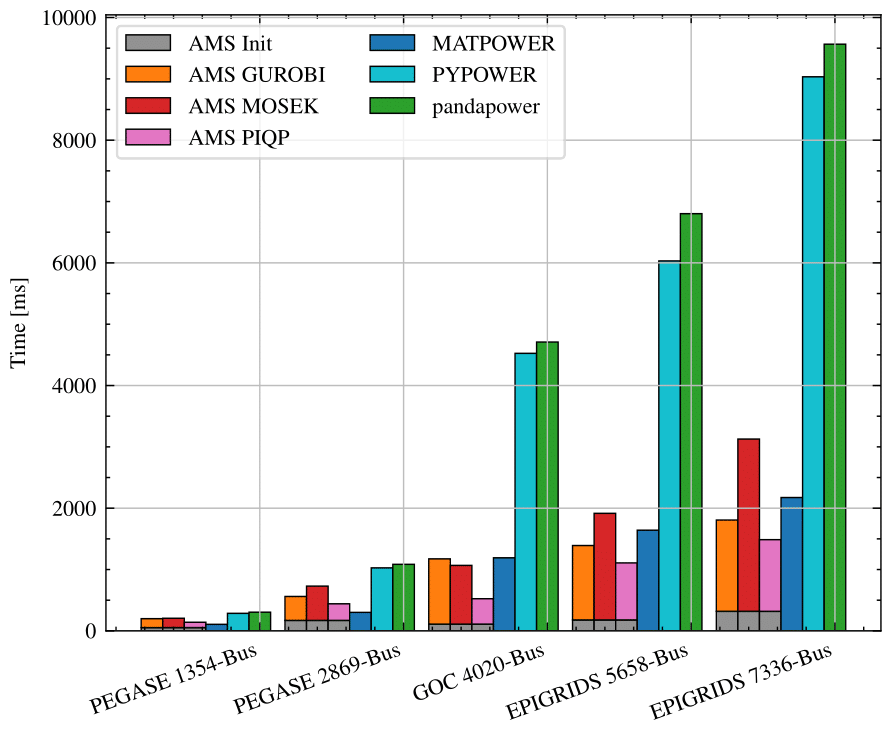
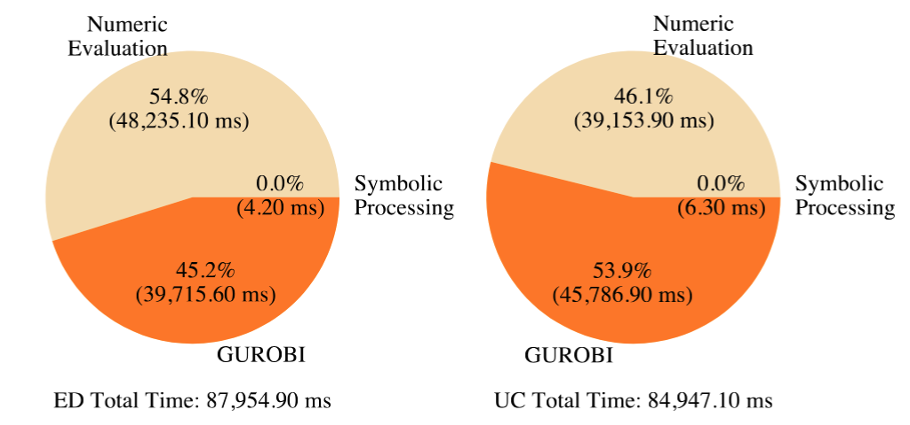

# LTB AMS

Python Software for Power System Scheduling Modeling and Co-Simulation with Dynamics, serving as the market simulator for the [CURENT Largescale Testbed][LTB Repository].


[](https://ieeexplore.ieee.org/document/10836855)


| Badges |  |  |
|---|---|---|
| Repo |  |  |
| Version | [](https://pypi.org/project/ltbams/) | [](https://anaconda.org/conda-forge/ltbams) |
| Tag | [](https://github.com/CURENT/ams/tags) |  |
| Documentation | [](https://ltb.readthedocs.io/projects/ams/en/stable/?badge=stable) | [](https://ltb.readthedocs.io/projects/ams/en/develop/?badge=develop) |
| Download | [](https://pypi.org/project/ltbams/) | [](https://anaconda.org/conda-forge/ltbams) |
| Code Quality |  |  |
| Code Cov |  |  |
| Last Commit |  |  |
| CI | [](https://github.com/CURENT/ams/actions/workflows/compatibility.yml) | [](https://dev.azure.com/curentltb/ams/_build/latest?definitionId=2&branchName=scuc) |
| CD | [](https://github.com/CURENT/ams/actions/workflows/publish-pypi.yml) |  |
| Structure | [](https://mango-dune-07a8b7110.1.azurestaticapps.net/?repo=CURENT%2Fams) | [](https://deepwiki.com/CURENT/ams) |
| Dependency | [](https://libraries.io/pypi/ltbams) |  |
| Try on Binder | [](https://mybinder.org/v2/gh/curent/ams/master) |  |

# Why AMS

AMS facilitates **Dynamics Incorporated Scheduling** and **Scheduling-Dynamics Co-Simulation**
through an integrated interface with ANDES.

This package is helpful for power system engineers, researchers, and students conducting
scheduling and transient stability studies at specific operating points. It also benefits
those interested in developing new scheduling formulations and algorithms, particularly
by extending existing formulations to include new decision variables, constraints, and
objective functions.

AMS is a **Modeling Framework** that provides a descriptive way to formulate
scheduling problems. The optimization problems are then handled by **CVXPY**
and solved with third-party solvers.

AMS produces credible scheduling results and competitive performance.
The following results show the comparison of DCOPF between AMS and other tools.
In the table, **AMS Gap** is the difference between the AMS and MATPOWER results,
and **pandapower Gap** is the difference between the pandapower and MATPOWER results.

| Case             | MATPOWER [\$] | AMS Gap [\$] | pandapower Gap [\$] |
|------------------|--------------|--------------|---------------------|
| IEEE 14-Bus      | 7,642.59     | 0.00         | 0.00                |
| IEEE 39-Bus      | 41,263.94    | 0.00         | 0.00                |
| PEGASE 89-Bus    | 5,733.37     | 0.00         | 0.00                |
| IEEE 118-Bus     | 125,947.88   | 0.00         | 0.00                |
| NPCC 140-Bus     | 810,033.37   | 0.00         | **-17.31**          |
| WECC 179-Bus     | 411,706.13   | 0.00         | 0.00                |
| IEEE 300-Bus     | 706,292.32   | 0.00         | 0.00                |
| PEGASE 1354-Bus  | 1,218,096.86 | 0.00         | 0.00                |
| PEGASE 2869-Bus  | 2,386,235.33 | 0.00         | 0.00                |
| GOC 4020-Bus     | 793,634.11   | 0.00         | 0.00                |
| EPIGRIDS 5658-Bus| 1,195,466.12 | 0.00         | 0.00                |
| EPIGRIDS 7336-Bus| 1,855,870.94 | 0.00         | 0.00                |

<div style="text-align: left;">
  
  <p><strong>Figure:</strong> Computation time of OPF on medium to large cases.</p>
</div>

In the bar chart, the gray bar labeled "AMS Symbolic Processing" represents the time spent
on symbolic processing, while the wheat-colored bar "AMS Numeric Evaluation" represents the
time spent on system matrices calculation and optimization model construction.
The orange bar labeled "AMS GUROBI" represents the optimization-solving time using the GUROBI solver.
Similarly, the red bar labeled "AMS MOSEK" and the pink bar labeled "AMS PIQP" represent the
time used by the solvers MOSEK and PIQP, respectively.
Regarding the baselines, the blue and green bars represent the running time of MATPOWER using
solver MIPS and pandapower using solver PIPS, respectively.
The results for AMS, pandapower, and matpower are the average time consumed over ten repeat tests.

<div style="text-align: left;">
  
  <p><strong>Figure:</strong> Computation time distribution for multi-period economic dispatch and
unit commitment using a 31,777-bus case.</p>
</div>

To further demonstrate AMS's scalability, we validated multi-period economic dispatch and unit commitment
on an ultra-large power system case with 31,777 buses, 4,664 generators, 41,573 transmission lines,
and 5 time intervals.
The computation time distribution for this case is shown in the figure below. Notably, the time spent
on symbolic processing remains negligible even at this scale, highlighting AMS's efficiency for
large-scale studies.

AMS is currently under active development.
Use the following resources to get involved.

-  Start from the [documentation][readthedocs] for installation and tutorial.
-  Check out examples in the [examples folder][examples]
-  Read the model verification results in the [examples/verification folder][verification]
-  Ask a question in the [GitHub Discussions][Github Discussions]
-  Report bugs or issues by submitting a [GitHub issue][GitHub issues]
-  Submit contributions using [pull requests][GitHub pull requests]
-  Read release notes highlighted [here][release notes]
-  Try in Jupyter Notebook on [Binder][Binder]
-  Check out the source code used for [benchmark][benchmark]
-  Check out and and cite our [paper][paper]

# Installation

AMS is released as ``ltbams`` on PyPI and conda-forge.
Install from PyPI using pip:

```bash
pip install ltbams
```

You can also install with optional dependencies, such as ``dev``, ``docs``, and ``nlp``:

```bash
pip install ltbams[dev]
pip install ltbams[docs]
pip install ltbams[nlp]
```

Or install with all optional dependencies:

```bash
pip install ltbams[all]
```

Install from conda-forge using conda:

```bash
conda install conda-forge::ltbams
```

Install from GitHub source:

```bash
pip install git+https://github.com/CURENT/ams.git
```

***NOTE:***
- `cvxpy` is distributed with the open source solvers CLARABEL, OSQP, and SCS, but MIP-capable solvers need separate installation
- `cvxpy` versions **below 1.5** are incompatible with `numpy` versions **2.0 and above**
- If the solver `SCIP` encounters an import error caused by a missing `libscip.9.1.dylib`, try reinstalling its Python interface by running `pip install pyscipopt --no-binary scip --force`
- `kvxopt` is recommended to install via `conda` as sometimes ``pip`` struggles to set the correct path for compiled libraries, more detailes can be found in this closed issue [Bug with dependency kvxopt 1.3.2.0](https://github.com/CURENT/andes/issues/508)
- Versions **1.0.0** and **1.0.1** are only available on PyPI
- Version **0.9.9** has known issues and has been yanked from PyPI

# Example Usage

```python
import ams
import andes

ss = ams.load(ams.get_case('ieee14/ieee14_uced.xlsx'))

# solve RTED
ss.RTED.run(solver='CLARABEL')

ss.RTED.pg.v
>>> array([1.8743862, 0.3226138, 0.01     , 0.02     , 0.01     ])

# convert to ANDES case
sa = ss.to_andes(addfile=andes.get_case('ieee14/ieee14_full.xlsx'),
                 setup=True, verify=False)
sa
>>> <andes.system.System at 0x14bd98190>
```

# Citing AMS
If you use AMS for research or consulting, please cite the following paper in your publication that uses AMS:

> J. Wang et al., "Dynamics-incorporated Modeling Framework for Stability Constrained Scheduling Under High-penetration of Renewable Energy," in IEEE Transactions on Sustainable Energy, doi: 10.1109/TSTE.2025.3528027.

# Sponsors and Contributors
AMS is the scheduling simulation engine for the CURENT Largescale Testbed (LTB).
More information about CURENT LTB can be found at the [LTB Repository][LTB Repository].

This work was supported in part by the Engineering Research Center Program of the National Science Foundation and the Department of Energy
under NSF Award Number EEC-1041877 and the CURENT Industry Partnership Program.

This work was supported in part by the Advanced Grid Research and Development Program in the Office of Electricity at the U.S. Department of Energy.

See [GitHub contributors][GitHub contributors] for the contributor list.

# License
AMS is licensed under the [GPL v3 License](./LICENSE).

# Related Projects
- [Popular Open Source Libraries for Power System Analysis](https://github.com/ps-wiki/best-of-ps)
- [G-PST Tools Portal](https://g-pst.github.io/tools/): An open tools portal with a classification approach
- [Open Source Software (OSS) for Electricity Market Research, Teaching, and Training](https://www2.econ.iastate.edu/tesfatsi/ElectricOSS.htm)

Some commercial solvers provide academic licenses, such as COPT, GUROBI, CPLEX, and MOSEK.

* * *

[GitHub releases]:       https://github.com/CURENT/ams/releases
[GitHub issues]:         https://github.com/CURENT/ams/issues
[Github Discussions]:    https://github.com/CURENT/ams/discussions
[GitHub insights]:       https://github.com/CURENT/ams/pulse
[GitHub pull requests]:  https://github.com/CURENT/ams/pulls
[GitHub contributors]:   https://github.com/CURENT/ams/graphs/contributors
[readthedocs]:           https://ams.readthedocs.io
[release notes]:         https://ams.readthedocs.io/en/latest/release-notes.html
[examples]:              https://github.com/CURENT/ams/tree/master/examples
[verification]:          https://github.com/CURENT/ams/tree/master/examples/verification
[Binder]:                https://mybinder.org/v2/gh/curent/ams/master
[LTB Repository]:        https://github.com/CURENT
[benchmark]:             https://github.com/CURENT/demo/tree/master/demo/ams_benchmark
[paper]:                 https://ieeexplore.ieee.org/document/10836855