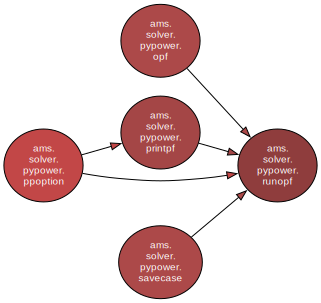
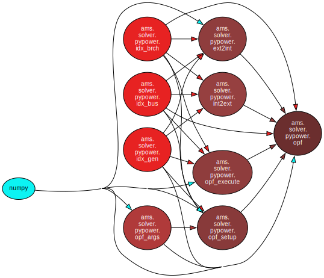

# Development notes

## PYPOWER

``runpf`` integrates ``pfsoln`` to solve power flow, and ``rundcpf``is an wrapper of ``runpf``.

### Structure

Note: With packages ``graphviz`` and ``pydeps``, we can have visualize the module dependency.

Structure of ``runopf``

```

```

Structure of ``opf``

```

```

Visualize ``runopf``:

```
pydeps /Users/jinningwang/Documents/work/ams/ams/solver/pypower/runopf.py -o runopf.svg --rankdir LR --exclude-exact ams ams.main ams.system ams.core ams.utils
```

Visualize ``opf``:

```
pydeps /Users/jinningwang/Documents/work/ams/ams/solver/pypower/opf.py -o opf.svg --rankdir LR --exclude-exact ams ams.main ams.system ams.core ams.utils
```
