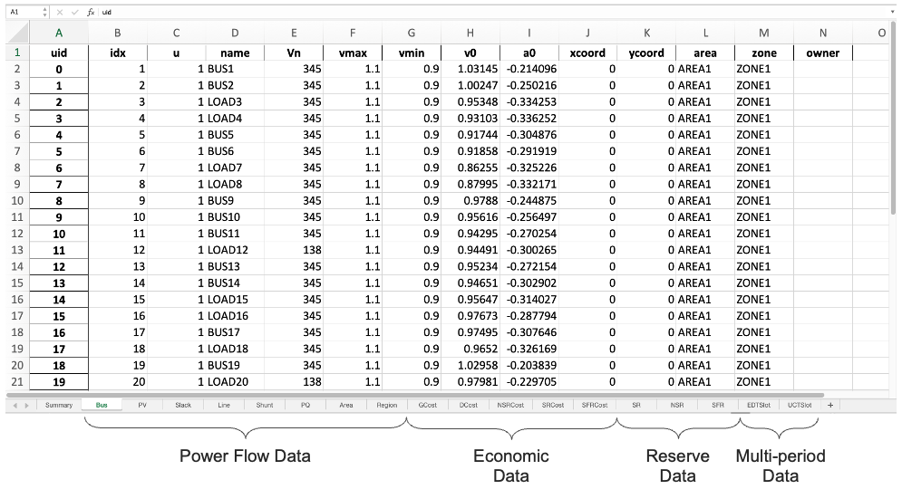

.. _input-xlsx:

AMS xlsx
----------

The AMS xlsx format allows one to use Excel for convenient viewing and
editing. If you do not use Excel, there are alternatives such as the free and
open-source `LibreOffice <https://www.libreoffice.org>`_.

Format definition
.................

The AMS xlsx format contains multiple workbooks (also known as "sheets") shown
as tabs at the bottom. The name of a workbook is a *model* name, and each
workbook contains the parameters of all *devices* that are *instances* of the
model.

Benefiting from a consistent format style, data manipulation is similar to that in 
`ANDES xlsx <http://andes.rtfd.io/en/latest/getting_started/formats/xlsx.html>`_.
